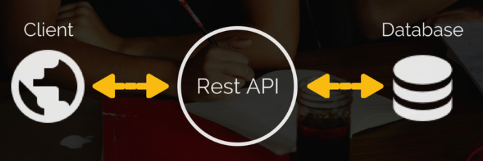
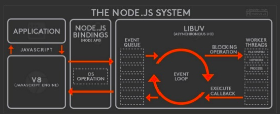

# NodeJS_REST_API
HOLA
 
 

<h1>THIS ARE THE STEPS TO CREATE A NODE JS DEST API</h1>

<h2>1. We initialice the project with npm init</h2>
This create a package.json

<h2>2. Install express with npm i express</h2>
This create all the nodes modules neccesary to run express server

<h2>3. create an app.js</h2>
y aqui damos de alta el server

const express = require('express');
const app = express();

app.listen(3003, () => {
console.log("SERVER UP PPAPU");
})

